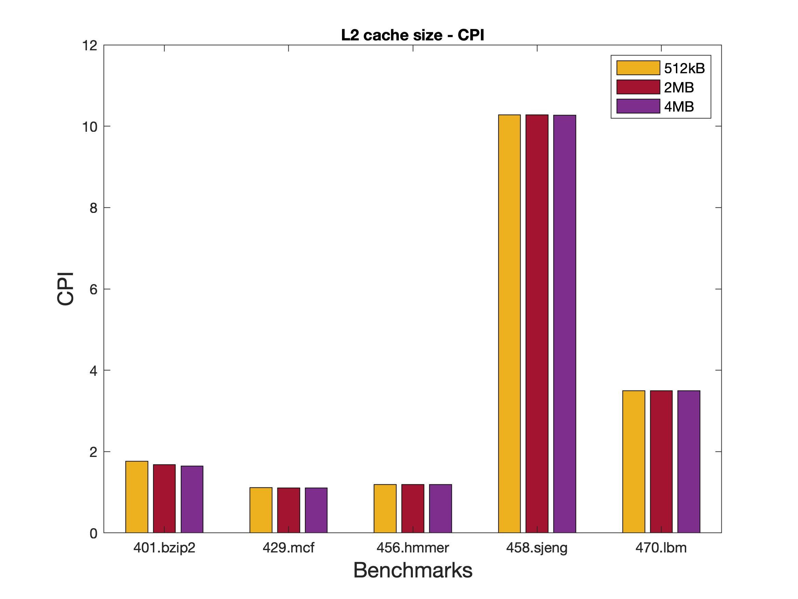
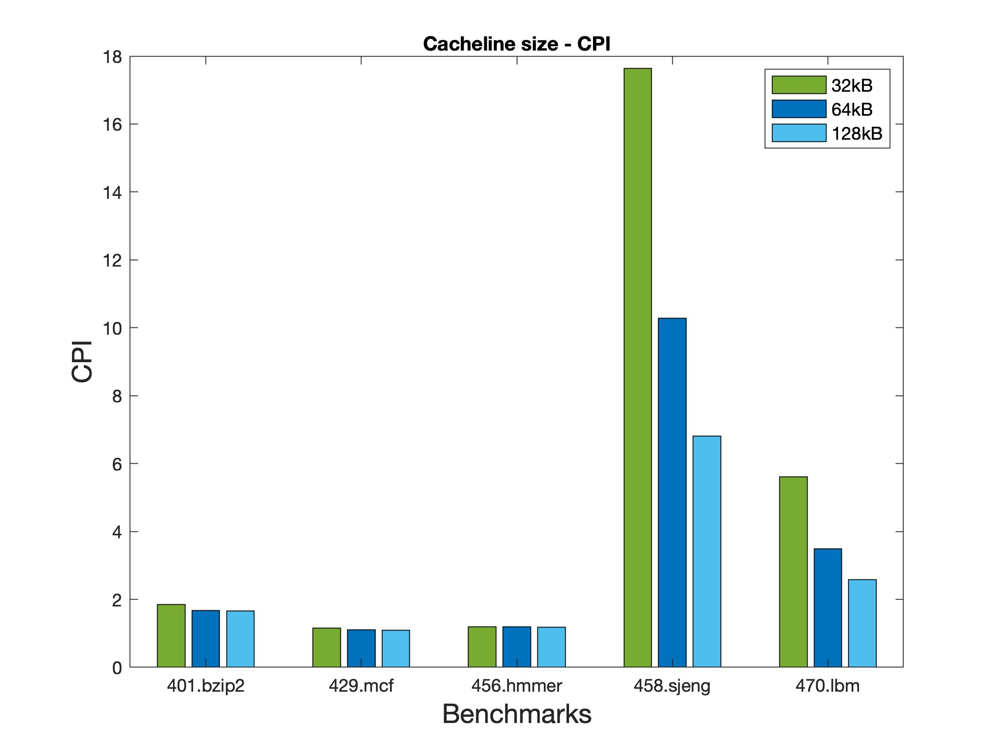
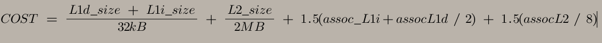

# Αρχιτεκτονική Προηγμένων Υπολογιστών

 **Καράμπελας Σάββας, ΑΕΜ: 9005**  
 **Καράμπελας Νίκος, ΑΕΜ: 8385**

## **Εργαστηριακή Άσκηση 2**  
Σε αυτήν την εργαστηριακή άσκηση ασχολούμαστε με την εκτέλεση μιας σειράς από benchmarks.Χρησιμοποιήσαμε ένα υποσύνολο των SPEC cpu2006 benchmarks. Περισσότερες  πληροφορίες για αυτά υπάρχουν στο εξής [link](https://www.spec.org/cpu2006/).  

Η εκτέλεση των benchmarks **στον gem5** έγινε χρησιμοποιώντας το configuration script se.py και ορίστηκε ένα μέγιστο όριο για τον αριθμό των εντολών που επιτρέπεται να εκτελεστούν. Αυτό έγινε διότι αν εκτελεστούν πλήρως τα benchmarks αυτά στον gem5, απαιτείται πάρα πολύ ώρα. Το όριο αυτό των εντολών τέθηκε στις 100.000.000. Ακόμα, για τις προσομοιώσεις χρησιμοποιήθηκε το μοντέλο **MinorCPU** με caches που συμπεριλαμβάνουν και caches δεύτερου επιπέδου(L2).Παρακάτω έχουν παρατεθέι οι εντολές με τις οποίες εκτελέστηκαν τα benchmarks:


```bash
 ./build/ARM/gem5.opt -d spec_results/specbzip configs/example/se.py --cpu- type=MinorCPU --caches --l2cache -c spec_cpu2006/401.bzip2/src/specbzip -o "spec_cpu2006/401.bzip2/data/input.program 10" -I 100000000
```  
```bash
./build/ARM/gem5.opt -d spec_results/specmcf configs/example/se.py --cpu- type=MinorCPU --caches --l2cache -c spec_cpu2006/429.mcf/src/specmcf -o "spec_cpu2006/429.mcf/data/inp.in" -I 100000000
```
```bash
./build/ARM/gem5.opt -d spec_results/spechmmer configs/example/se.py --cpu- type=MinorCPU --caches --l2cache -c spec_cpu2006/456.hmmer/src/spechmmer -o "-- fixed 0 --mean 325 --num 45000 --sd 200 –-seed 0 spec_cpu2006/456.hmmer/data/bombesin.hmm" -I 100000000
```
```bash
./build/ARM/gem5.opt -d spec_results/specsjeng configs/example/se.py --cpu- type=MinorCPU --caches --l2cache -c spec_cpu2006/458.sjeng/src/specsjeng -o "spec_cpu2006/458.sjeng/data/test.txt" -I 100000000
```
```bash
./build/ARM/gem5.opt -d spec_results/speclibm configs/example/se.py --cpu-
type=MinorCPU --caches --l2cache -c spec_cpu2006/470.lbm/src/speclibm -o "20
spec_cpu2006/470.lbm/data/lbm.in 0 1
spec_cpu2006/470.lbm/data/100_100_130_cf_a.of" -I 100000000
```

 >### Βήμα 1 - Execution of Benchmarks

A)Αφού εκτελέσουμε διαδοχικά τις παραπάνω εντολές στον gem5, ανατρέχουμε στα αρχεία αποτελεσμάτων(stats.txt, config.ini, config.json) και βρίσκουμε τις βασικές παραμέτρους για τον επεξεργαστή που εξομοιώνει ο gem5 όσον αφορά το υποσύστημα μνήμης.Πιο συγκεκριμένα, στο πίνακα παρακάτω, παρουσιάζονται τα μεγέθη των caches, το associativity κάθε μιας από αυτές και το μέγεθος της cache line.  


| **Παράμετρος**    | **Size**  |**Associativity**|
| ------------- | ------------- |---------------|
| L1 DCache     | 64kB          | 2           |
| L1 ICache     | 32kB          | 2           |
| L2 Cache      | 2MB           | 8           |
| Cache Line    | 64kB          | -           |


B)Στη συνέχεια αναζητούμε πάλι στα αρχεία αποτελεσμάτων και σημειώνουμε τις παρακάτω πληροφορίες για κάθε benchmark:  
* Χρόνο εκτέλεσης(ο χρόνος που απαιτεί το πρόγραμμα για να τρέξει στον εξομοιούμενο επεξεργαστή)
*  CPI(Cycles Per Instruction)
*  Τα συνολικά miss rates για την L1 Data cache, την L1 Instruction cache και την L2 cache.

Οι πληροφοίες αυτές παρουσιάζονται συνοπτικά στον παρακάτω πίνακα:

| **Benchmark**    | **Execution time(s)**  |**CPI**|**L1 Dcache MR(%)**|**L1 Icache MR(%)**|**L2 MR(%)**|
| ------------- | ------------- |---------------|------|------|-----|
| **401.bzip2**     |0.083847  |1.676947   | 0.014289 | 0.000075 |0.294749|
| **429.mcf**       |0.055471  |1.109419   |0.002038  | 0.000037 |0.727788|
| **456.hmmer**     |0.059410  |1.188197   | 0.001692 | 0.000204 |0.079948|
| **458.sjeng**     |0.513819  |10.276385  |0.121829  | 0.000020 |0.999979|
| **470.lbm**       |0.174779  |3.495573   |0.060971  | 0.000098 |0.999927|

Παρακάτω παρουσιάζονται και τα σχετικά διαγράμματα:

  <br><br>
Για το χρόνο εκτέλεσης παρατηρούμε ότι τα 401.bzip2, 429.mdf και 456.hmmer benchmarks εκτέλουνται σε λιγότερο από 0.1 seconds ενώ το 458.sjeng σε 0.5 και το 470.lbm σχεδόν στα 0.2 seconds.  <br>

  <br><br>
Το CPI μας γενικότερα θέλουμε να είναι όσο πιο κοντά στη μονάδα και ιδανικά να είναι ίσο με αυτή. Επειδή έχουμε θεωρήσει ότι ο επεξεργαστής στο μοντέλο MinorCPU μπορεί να εκτελλεί μόνο μια εντολή ανά κύκλό, όταν το CPI είναι μεγαλύτερο από την μονάδα, σημαίνει ότι ο επεξεργαστής αργεί να πάρει εντολές και δεδομένα από τις μνήμες. Παρατηρούμε ότι τα χαμηλότερα CPI τα έχουν το 429.mfc και το 456.hmmer benchmarks με τιμή ελάχιστα πάνω από την μονάδα. Στη συνέχεια ακολουθεί το 401.bzip2 με τιμή λίγο κάτω από δύο. Τέλος, τα 458.sjeng και 470.lbm έχουν αρκετά υψηλό CPI κάτι το οποίο είναι ανεπιθύμητο. Πιο συγκεκριμένα το 458.sjeng έχει λίγο πάνω από δέκα και το 470.lbm σχεδόν 3.5.  

   <br><br>
Στο διάγραμμα για το miss rate της L1 Dcache παρατηρούμε ότι υπάρχει μία διαβάθμιση ανάμεσα στις τιμές των benchmarks. Αναλυτικότερα, τα 429.mcf και 456.hmmer έχουν αρκετά μικρό miss rate με ποσοστό 0.002038% και 0.001692% αντίστοιχα. Ακολουθεί το 401.bzip2 με τιμή 0.014289% και μετά βλέπουμε ότι τα υπόλοιπα δύο έχουν αρκετά σημαντικότερο miss rate με ποσοστά 0.121829% και 0.060971% το 458.sjeng και το 470.lbm αντίστοιχα.

  <br><br>
Στο διάγραμμα για το miss rate της L1 Icache παρατηρούμε ότι όλα τα benchmarks έχουν πολύ χαμηλή ποσοστό, της τάξης του 10^-4. Αναλυτικότερα, το χαμηλότερο miss rate το έχει το 458.sjeng με ποσοστό 0.000020%, μετά ακολουθούν τα 429.mcf με 0.000037% και το 401.bzip2 με 0.000075%. Τέλος, έχουμε το 470.lbm με ποσοστό 0.000098% και το 456.hmmer που έχει και το μεγαλύτερο miss rate στην Icache με ποσοστό 0.000204%.  

  <br><br>
Στο διάγραμμα για το miss rate της L2 cache παρατηρούμε ότι τα μεγέθη είναι εμφανώς μεγαλύτερα σε σχέση με αυτά που είχαμε στην cache πρώτου επιπέδου. Αναλυτικότερα, το μικρότερο miss rate το παρουσιάζει το benchmark 456.hmmer με ποσοστό 0.079948%. Το αμέσως μεγαλύτερο ποσοστό το έχει το 401.bzip2 με τιμή 0.294749%. Τέλος, τα υπόλοιπα benchmarks παρουσιάζουν πάρα πολύ υψηλό miss rate! Συγκεκριμένα, το 429.mfc έχει 0.727788% ενώ τα 458.sjeng και 470.lbm έχουν 0.999979% και 0.999927% αντίστοιχα. Τα τελευταία δύο δηλαδή έχουν σχεδόν πάντα miss όταν κάνονυ access την L2 προκειμένου να βρουν κάποια πληροφορία.


C)Σε αυτό το σημείο τρέχουμε ξανά όλα τα παραπάνω benchmarks με τον ίδιο τρόπο με προηγουμένως αλλά αυτή τη φορά προσθέτουμε τη παράμετρο **_--cpu-clock = 1GHz_**. Σημειώνεται εδώ ότι καθώς χρησιμοποιούμε την τελευταία έκδοση του gem5, η οποία έχει by default cpu-clock = 2GHz, για να παρατηρήσουμε διαφορά στις εκτελέσεις θα το θέσουμε στα 1GHz. Αναζητώντας στα αρχεία αποτελεσμάτων των δύο εκτελέσεων βρίσκουμε πληροφορίες για τις παραμέτρους **system.clk_domain.clock** και **cpu_cluster.clk_domain.clock**.   

Παρατηρούμε ότι και στις δύο προσομοιώσεις η τιμή της εισαγωγής system.clk_domain.clock είναι ίδια και ισούται με 1000ps. Ωστόσο, η τιμή της εισαγωγής cpu_cluster.clk_domain.clock αλλάζει από **500** που ήταν αρχικά σε **1000**ps. Αυτό είναι και το αναμενομένο. Η πρώτη παράμετρος αναφέρεται στο ρολόι του συστήματος το οποίο είναι σταθερό και έχει συχνότητα 1GHz, και γι'αυτό και η περίοδος ισούται με 1000ps και στις δύο εκτελέσεις. Η παράμετρος, τώρα, cpu_cluster.clk_domain.clock αναφέρεται στο ρολόι της CPU που χρησιμοποιούμε. Έτσι, στην πρώτη εκτέλεση που δε θέτουμε το cpu-clock, αυτό παίρνει τη default τιμή των 2GHz και συνεπώς η περίοδος έχει τιμή Τ = 500ps. Στη δεύτερη εκτέλεση που θέτουμε cpu-clock = 1GHz, η περίοδος όπως είναι φυσικό θα αυξηθεί και θα έχει τιμή T = 1000ps.  

Εάν προσθέσουμε ακόμα έναν επεξεργαστή, το λογικό θα ήταν να έχει την ίδια συχνότητα με τον επεξεργαστή που έχουμε ήδη. Έτσι, θα μας έδιναν για ένα input το ίδιο throughput με έναν επεξεργαστή της διπλάσιας συχνότητας,αλλά απαιτώντας λιγότερη ισχύ αφού ισχύει η σχέση:

  _P = C * F * V^2_

Τέλος, συγκρίνοντας τους χρόνους εκτέλεσης των benchmarks για τις δύο διαφορετικές συχνότητες λειτουργίας, είναι εμφανές ότι με τη μικρότερη συχνότητα οι χρόνοι εκτέλεσης είναι μία τάξη μεγέθους μεγαλύτεροι(σχεδόν διπλάσιοι). Αντίστοιχα, αν ξεκινούσαμε με 1GHz και διπλασιάζαμε την συχνότητα θα παρατηρούσαμε σχεδόν υποδιπλασιασμό του χρόνου εκτέλεσης. Αυτά που απέχουν περισσότερο από την τιμή υποδιπλασιασμού είναι τα 458.sjeng και 470.lbm benchmarks. Συνεπώς δεν υπάρχει τέλειο scaling.

| **Benchmark**    | **F=2GHz** | **F=1GHz**|
| ------------- | ------------- |---------------|
| **401.bzip2**     |0.083847  |0.160703  |
| **429.mcf**       |0.055471  |0.109233  |
| **456.hmmer**     |0.059410  |0.118547  |
| **458.sjeng**     |0.513819  |0.705453  |
| **470.lbm**       |0.174779  |0.262248  |


>### Βήμα 2 - Design Exploration<br><br>
<br><br>
  <br><br>
Το default size της L1 Icache του μοντέλου μας ήταν 32kB. Παρατηρούμε ότι αυξάνοντας το μέγεθος της L1 Icache είτε στα 64kB είτε στα 128kB το CPI μειώνεται απειροελάχιστα(σχεδόν καθόλου) για κάθε benchmark. Επίσης, η μείωση του miss rate στις caches ήταν πολύ μικρή. Αυτά σε συνδυασμό με το γεγονός ότι είναι πολύ υψηλό το κόστος αύξησης της μνήμης πρώρου επιπέδου, δεν τη καθιστά ελκυστική μέθοδο για τη σχεδίαση μας η οποία αποσκοπεί στη μείωση του CPI.  

<br><br>
Το default associativity της L1 Icache μας ήταν 2. Αυξάνοντας το associativity μας διαδοχικά στις τιμές 4,8,16 παρατηρούμε μία μικρή μείωση του CPI καθώς και του miss rate σε όλες τις caches για κάθε benchmark. Εδώ πρέπει να σημειωθεί ότι όσο αυξάνουμε το associativity, αυξάνεται και η πολυπλοκότητα.  <br>

  <br><br>
Το default size της L1 Dcache του μοντέλου μας ήταν 64kB.Παρατηρούμε ότι αν μειώσουμε το μέγεθος στα 32kB θα αυξηθεί το CPI για όλα τα benchmarks και το miss rate θα μειωθεί σε ένα μικρό βαθμό. Ακόμα, παρατηρούμε ότι αυξάνοντας το μέγεθος της L1 Dcache στα 128kB το CPI μειώνεται. Επίσης, η μείωση του miss rate στις caches ήταν πολύ μικρή. Αυτά σε συνδυασμό με το γεγονός ότι είναι πολύ υψηλό το κόστος αύξησης της μνήμης πρώρου επιπέδου, δεν τη καθιστά ελκυστική μέθοδο για τη σχεδίαση μας η οποία αποσκοπεί στη μείωση του CPI. <br>  

  <br><br>
Το default associativity της L1 Dcache μας ήταν 2. Αυξήσαμε το associativity διαδοχικά στις τιμές 4, 8 και 16 και παρατηρήσαμε βελτείωση ως προς τα miss rate. Ωστόσο, μετά από την περιπτώση του 8-way associativity η διαφορά ήταν τόσο μικρή που δεν αξίζει να επιλέξουμε μεγαλύτερη τιμή, ειδικά με την πολυπλοκότητα που θα εισάγεται στο σύστημα μας.  <br><br>
    <br><br>
Το default size της L2 cache ήταν 2MB. Δοκιμάσαμε να αυξήσουμε την τιμή αυτή στα 4MB αλλά και να τη μειώσουμε στα 512kB ώστε να έχουμε μία καλύτερη εικόνα της συμπεριφοράς του συστήματος. Μειώνοντας την τιμή στα 512kB όπως περιμέναμε το CPI αυξήθηκε και γενικώς το σύστημα μας παρουσιάζει χειρότερη επίδοση. Στη περίπτωση των 4MB μειώνεται λίγο το CPI καθώς και το miss rate της L2 αλλά όχι αρκετά ώστε  να αξίζει το κόστος που θα έχουμε για αυτόν τον διπλασιασμό μεγέθους.Τα υπόλοιπα miss rate που αφορόυν τις caches πρώτου επιπέδου παραμένουν πάνω κάτω στις ίδιες τιμές.<br><br>
  <br>   
Το default associativity της L2 cache ήταν 8. Δοκιμάσαμε να μειώσουμε αρχικά την τιμή αυτή σε 4-way associativity και στην συνέχεια την αυξήσαμε σε 16 και 32. Παρατηρήσαμε ότι τα μόνα benchmarks στα οποία υπήρχε μία πολύ μικρή βελτίωση ως προς το CPI ήταν το 401.bzip2 και το 458.sjeng. Τα υπόλοιπα είχαν ελάχιστη πρακτικά βελτιώση μόνο ως προς το miss rate της L2. Βλέπουμε πάντως και σε αυτή τη περίπτωση ότι πιθανά δεν αξίζει μια επιλογής αύξησης του associativity, καθώς εισάγει μεγάλη πολυπλοκότητα αλλά επιφέρει μικρό κέρδος στην απόδοση.<br><br>
   <br><br>
Το default Cache Line ήταν 64kB. Δοκιμάσαμε να μειώσουμε το cache line στα 32kB και να το αυξήσουμε και στα 128kB. Με cache line = 32kB το CPI αυξάνεται έντονα για όλα τα benchmarks και το ίδιο ισχύει και για τα miss rates σε όλες τις caches. Αντιθέτως, όταν έχουμε cache line 128kB μειώνεται το CPI για όλα τα benchmarks και ειδικά στο 458.sjeng. Για το 470.lbm, το 458.sjeng και το 429.mcf το L1 Dcache miss rate σχεδόν υποδιπλασιάζεται και στα υπόλοιπα μειώνεται αλλά όχι τόσο έντονα. Επίσης το Icache miss rate μειώνεται αλλά επειδή ήταν ήδη πολύ μικρά, η διαφορά δεν είναι αισθητή. Στην L2 παρατηρούμε αισθητή βελτίωση στα miss rate για το 401.bzip2 και για τα υπόλοιπα benchmarks μικρές βελτιώσεις.


>### Βήμα 3 - Κόστος απόδοσης και βελτιστοποίηση  
Γνωρίζουμε από την σχεδίαση των ψηφιακών κυκλωμάτων ότι μία μνήμη μεγέθους Α έχει υψηλότερο κόστος υλοποίησης σε σχέση με μία μνήμα μεγέθους Β, με B < A. Αντίστοιχα, γνωρίζουμε ότι μια μνήμη μεγάλου μεγέθους είναι πιο αργή από μια μνήμη μικρού μεγέθους και εκεί βασίζεται η λογική των caches και της ιεραρχίας μνημών. Παρακάτω έχουμε προσθέσει μία συνάρτηση κόστους η οποία παρουσιάζει την επίδραση των παραγόντων, που αλλάχτηκαν στο Βήμα 2 της εργασίας, όσον αναφορά το μέγεθος του κυκλώματος και την ταχύτητα. Δηλαδή, περιγράφει ποιο είναι το κόστος που θα πρέπει να πληρώσουμε κάνοντας μια επιλογή.

Για να υπολογίσουμε το κόστος κάθε παραμέτρου λαμβάνουμε υπόψιν τα εξής:
* Όσον αναφορά το μέγεθος, καθώς το αυξάνουμε αυξάνεται και το κόστος κατασκευής. Ειδικά στις L1 caches το κόστος είναι αισθητά υψηλότερο. Είναι λογικό λοιπόν να απαιτούμε σημαντική αύξηση των αποδόσεων(CPI κοντά σο 1, μείωση των miss rate) εάν αποφασίσουμε να αυξήσουμε το μέγεθος αυτών των μνημών.
* Όσον αναφορά το associativity, με την αύξηση του αυξάνεται και το κόστος, βέβαια όχι στον ίδιο βαθμό με τις μνήμες. Η ουσιαστική επίδραση που έχει αυτή η αύξηση είναι η εισαγωγή μεγαλύτερης πολυπλοκότητας στη δομή των caches.

Λαμβάνοντας όλα τα παραπάνω υπόψιν, καταλήγουμε στο ότι κάθε διπλασιασμός της μνήμης οδηγεί σε διπλάσιο κόστος και κάθε διπλασιασμός του associativity αυξάνει το κόστος κατά 1.5 περίπου. Η συνάρτηση φαίνεται παρακάτω:

  

Έχοντας κατασκευάσει λοιπόν την συνάρτηση κόστους, θα χρησιμοποιήσουμε τα αποτελέσματα που εξάγαμε στο Βήμα 2 για κάθε benchmark όσον αναφορά το CPI και θα προσδιορίσουμε την αρχιτεκτονική που βελτιστοποιεί την απόδοση του συστήματος σε σχέση με το κόστος του. Ξεκινώντας, είναι εμφανές ότι οι αλλαγές στο associativity των caches του πρώτου επιπέδου, αν και σε ορισμένα benchmarks οδήγουν σε μείωση του CPI, δεν αποτελούν καλή σχεδιαστική επιλογή. Η μείωση στο CPI είναι ιδιαίτερα χαμηλή και σε συνδυασμό με το γεγονός ότι εισάγουν μεγαλύτερη πολυπλοκότητα μας οδηγεί στο να αποφύγουμε αυτήν την επιλογή. Το ίδιο παρατηρήσαμε και για το associativity της L2 cache, συνεπώς θα την διατηρήσουμε στη default τιμή της. Συνεχίζοντας, κατά την εξευρένηση που κάναμε στο Βήμα 2 είδαμε ότι και η αύξηση του μεγέθους είτε των L1 caches είτε της L2 cache δεν μείωσε ιδιαίτερα το CPI.  Καθώς γνωρίζουμε ότι η αύξηση του μεγέθους των μνημών αυτών αποτελεί πολύ σημαντικό κόστος, επιλέγουμε να κρατήσουμε το default μέγεθος και ας έχουμε έλαχιστα μεγαλύτερο CPI. Τέλος, όσον αναφορά το μέγεθος του cache line, συμπεραίνουμε ότι έχει σημαντικό όφελος η αύξηση του. Αναλυτικότερα, είδαμε αισθήτη μείωση του CPI αλλά και χαμηλότερο miss rate στις caches. Αν και εμπεριέχει, όπως είναι προφανές, κάποιο κόστος η αύξηση του μεγέθους αυτού, θα κάνουμε αυτόν τον συμβιβασμό διότι αποφέρει μεγάλο όφελος. Παρακάτω παρουσιάζονται τα benchmarks με τις προτεινόμενες, δικές μας, τιμές παραμέτρων οι οποίες βασίζονται στη σχεδιαστική λογική που μόλις περιγράψαμε.

1) 401.bzip2:  
      * L1 Icache size: 32kB
      * L1 Icache associativity: 2
      * L1 Dcache size: 128kB
      * L1 Dcache associativity:4
      * L2 cache size: 2MB
      * L2 cache associativity:8
      * Cache line size: 128kB


 2) 429.mcf:  
      * L1 Icache size: 32kB
      * L1 Icache associativity:2
      * L1 Dcache size: 64kB
      * L1 Dcache associativity:4
      * L2 cache size: 2MB
      * L2 cache associativity:8
      * Cache line size: 128kB


 3) 456.hmmer:  
      * L1 Icache size: 32kB
      * L1 Icache associativity:2
      * L1 Dcache size: 64kB
      * L1 Dcache associativity:4
      * L2 cache size:2MB
      * L2 cache associativity:8
      * Cache line size: 32kB

  4) 458.sjeng:  
      * L1 Icache size: 32kB
      * L1 Icache associativity:2
      * L1 Dcache size:64kB
      * L1 Dcache associativity:4
      * L2 cache size:2MB
      * L2 cache associativity:8
      * Cache line size: 128kB

  5) 470.lbm:  
      * L1 Icache size: 32kB
      * L1 Icache associativity:2
      * L1 Dcache size:64kB
      * L1 Dcache associativity:4
      * L2 cache size:2MB
      * L2 cache associativity:8
      * Cache line size: 128kB


>### Αξιολόγηση Εργασίας  

Δυσκολία: <br>    
Η συγκεκριμένη εργασία δε μας δυσκόλεψε ιδιαίτερα, όσον αφορά το κομμάτι της εκτέλεσης. Γράψαμε ένα script
(automator.c) που τρέχει όλα τα benchmarks παράλληλα (το καθένα στο δικό του thread), για μία συγκεκριμένη
παράμετρο (πχ --l2_size=2MB), για να κάνουμε όλα τα compiles
με ευκολία και σε συνδιασμό με το bash script μου μας δώθηκε η συλλογή των αποτελεσμάτων αυτοματοποιήθηκε πλήρως. Το κομμάτι που μας
δυσκόλεψε, που είναι και η ουσία της εργασίας, ήταν το κομμάτι της σχεδίασης. Ψάξαμε αρκετά στην βιβλιογραφία αλλά και στο internet για να
κατανοήσουμε καλύτερα την σχεδίαση των caches και των πλεόνοκτημάτων vs tradeoffs που επιφέρουν αλλαγές σε αυτές.

Νέες Γνώσεις: <br>    
Ψάξαμε τα χαρακτηριστικά αυτά για
σύγχρονους επεξεργαστές και σε συνδιασμό με τα αποτελέσματα του gem5 μελετήσαμε τι δουλεύει καλύτερα στο δικό μας simulated σύστημα. Συνολικά μας
φάνηκε πολύ χρήσιμη εργασία γιατί πλέον είδαμε στην πράξη πως ακριβώς επηρεάζει κάθε χαρακτηριστικό την απόδοση.   <br>

Περιττές Δυσκολίες: <br>    


#### ΠΗΓΕΣ:

1)  [Evaluating Associativity in CPU Caches](http://pages.cs.wisc.edu/~markhill/papers/toc89_cpu_cache_associativity.pdf)<br>
2) [Architectures and Technologies of Cache Memory: A Survey](https://www.researchgate.net/publication/319523795_Architectures_and_Technologies_of_Cache_Memory_A_Survey)<br>
3) [Caching and Cache-Efficient Algorithms - MIT OpenCourseWare](https://www.youtube.com/watch?v=xDKnMXtZKq8)<br>
3) [An Overview of Cache Optimization Techniques and Cache-Aware Numerical Algorithms](https://www.researchgate.net/publication/2863424_An_Overview_of_Cache_Optimization_Techniques_and_Cache-Aware_Numerical_Algorithms)<br>
4) [Why software developers should care about CPU caches](https://medium.com/software-design/why-software-developers-should-care-about-cpu-caches-8da04355bb8a)<br>
5) [gem5 Documentation](http://www.gem5.org/assets/files/ASPLOS2017_gem5_tutorial.pdf  ) <br>
6) Computer Architecture a Quantitative Approach<br>
