# Αρχιτεκτονική Προηγμένων Υπολογιστών

 **Καράμπελας Σάββας, ΑΕΜ: 9005**  
 **Καράμπελας Νίκος, ΑΕΜ: 8385**

## **Εργαστηριακή Άσκηση 2**  
Σε αυτήν την εργαστηριακή άσκηση ασχολούμαστε με την εκτέλεση μιας σειράς από benchmarks.Χρησιμοποιήσαμε ένα υποσύνολο των SPEC cpu2006 benchmarks. Περισσότερες  πληροφορίες για αυτά υπάρχουν στο εξής [link](https://www.spec.org/cpu2006/).  

Η εκτέλεση των benchmarks **στον gem5** έγινε χρησιμοποιώντας το configuration script se.py και ορίστηκε ένα μέγιστο όριο για τον αριθμό των εντολών που επιτρέπεται να εκτελεστούν. Αυτό έγινε διότι αν εκτελεστούν πλήρως τα benchmarks αυτά στον gem5, απαιτείται πάρα πολύ ώρα. Το όριο αυτό των εντολών τέθηκε στις 100.000.000. Ακόμα, για τις προσομοιώσεις χρησιμοποιήθηκε το μοντέλο **MinorCPU** με caches που συμπεριλαμβάνουν και caches δεύτερου επιπέδου(L2).Παρακάτω έχουν παρατεθέι οι εντολές με τις οποίες εκτελέστηκαν τα benchmarks:


```bash
 ./build/ARM/gem5.opt -d spec_results/specbzip configs/example/se.py --cpu- type=MinorCPU --caches --l2cache -c spec_cpu2006/401.bzip2/src/specbzip -o "spec_cpu2006/401.bzip2/data/input.program 10" -I 100000000
```  
```bash
./build/ARM/gem5.opt -d spec_results/specmcf configs/example/se.py --cpu- type=MinorCPU --caches --l2cache -c spec_cpu2006/429.mcf/src/specmcf -o "spec_cpu2006/429.mcf/data/inp.in" -I 100000000
``` 
```bash
./build/ARM/gem5.opt -d spec_results/spechmmer configs/example/se.py --cpu- type=MinorCPU --caches --l2cache -c spec_cpu2006/456.hmmer/src/spechmmer -o "-- fixed 0 --mean 325 --num 45000 --sd 200 –-seed 0 spec_cpu2006/456.hmmer/data/bombesin.hmm" -I 100000000
``` 
```bash
./build/ARM/gem5.opt -d spec_results/specsjeng configs/example/se.py --cpu- type=MinorCPU --caches --l2cache -c spec_cpu2006/458.sjeng/src/specsjeng -o "spec_cpu2006/458.sjeng/data/test.txt" -I 100000000
``` 
```bash
./build/ARM/gem5.opt -d spec_results/speclibm configs/example/se.py --cpu-
type=MinorCPU --caches --l2cache -c spec_cpu2006/470.lbm/src/speclibm -o "20
spec_cpu2006/470.lbm/data/lbm.in 0 1
spec_cpu2006/470.lbm/data/100_100_130_cf_a.of" -I 100000000
``` 

 >### Βήμα 1 - Execution of Benchmarks

A)Αφού εκτελέσουμε διαδοχικά τις παραπάνω εντολές στον gem5, ανατρέχουμε στα αρχεία αποτελεσμάτων(stats.txt, config.ini, config.json) και βρίσκουμε τις βασικές παραμέτρους για τον επεξεργαστή που εξομοιώνει ο gem5 όσον αφορά το υποσύστημα μνήμης.Πιο συγκεκριμένα, στο πίνακα παρακάτω, παρουσιάζονται τα μεγέθη των caches, το associativity κάθε μιας από αυτές και το μέγεθος της cache line.  


| **Παράμετρος**    | **Size**  |**Associativity**|
| ------------- | ------------- |---------------|
| L1 DCache     | 64kB          | 2           |
| L1 ICache     | 32kB          | 2           |
| L2 Cache      | 2MB           | 8           |
| Cache Line    | 64kB          | -           |
  
    
B)Στη συνέχεια αναζητούμε πάλι στα αρχεία αποτελεσμάτων και σημειώνουμε τις παρακάτω πληροφορίες για κάθε benchmark:  
* Χρόνο εκτέλεσης(ο χρόνος που απαιτεί το πρόγραμμα για να τρέξει στον εξομοιούμενο επεξεργαστή)
*  CPI(Cycles Per Instruction)
*  Τα συνολικά miss rates για την L1 Data cache, την L1 Instruction cache και την L2 cache. 
  
Οι πληροφοίες αυτές παρουσιάζονται συνοπτικά στον παρακάτω πίνακα:
  
| **Benchmark**    | **Execution time(s)**  |**CPI**|**L1 Dcache MR(%)**|**L1 Icache MR(%)**|**L2 MR(%)**|
| ------------- | ------------- |---------------|------|------|-----|
| **401.bzip2**     |0.083847  |1.676947   | 0.014289 | 0.000075 |0.294749|
| **429.mcf**       |0.055471  |1.109419   |0.002038  | 0.000037 |0.727788|
| **456.hmmer**     |0.059410  |1.188197   | 0.001692 | 0.000204 |0.079948|
| **458.sjeng**     |0.513819  |10.276385  |0.121829  | 0.000020 |0.999979|
| **470.lbm**       |0.174779  |3.495573   |0.060971  | 0.000098 |0.999927|
  
Παρακάτω παρουσιάζονται και τα σχετικά διαγράμματα.  
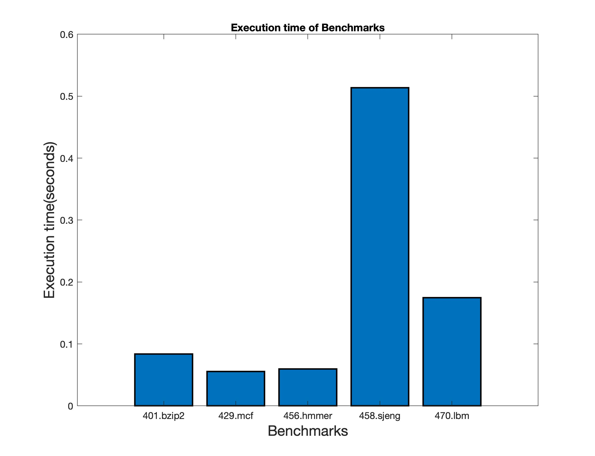 
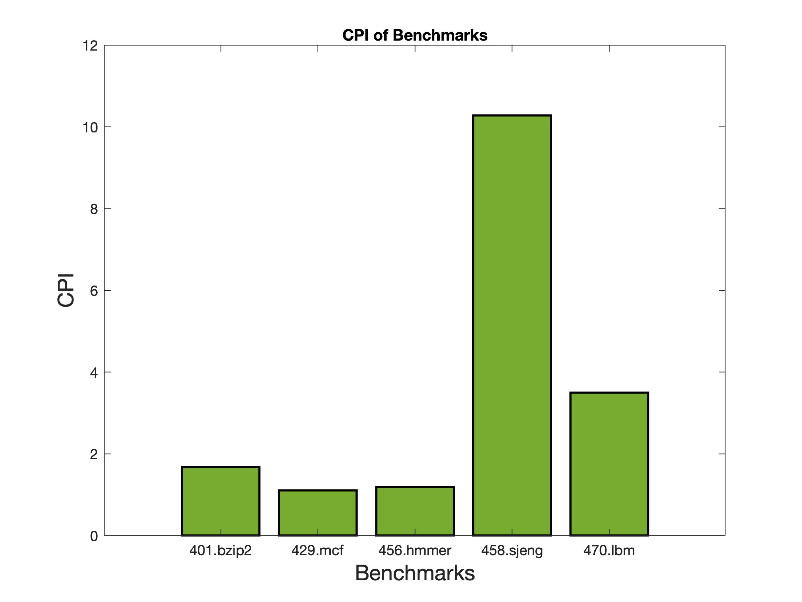
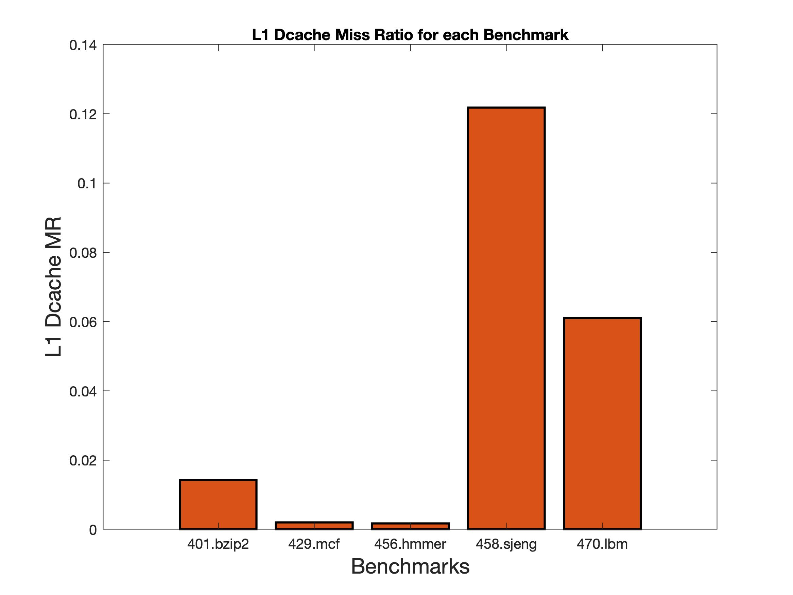 

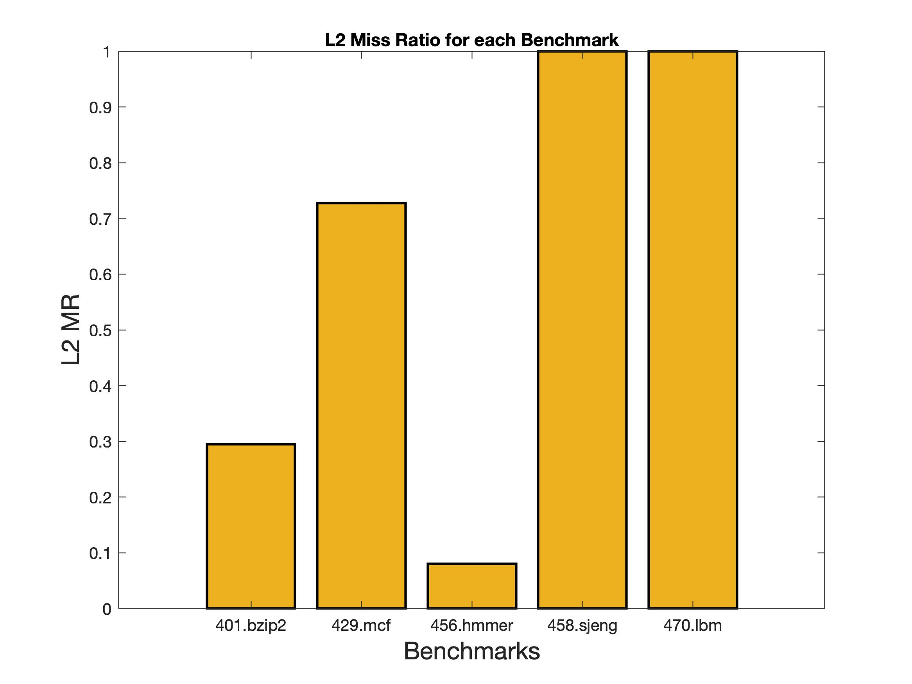 


C)Σε αυτό το σημείο τρέχουμε ξανά όλα τα παραπάνω benchmarks με τον ίδιο τρόπο με προηγουμένως αλλά αυτή τη φορά προσθέτουμε τη παράμετρο **_--cpu-clock = 1GHz_**. Σημειώνεται εδώ ότι καθώς χρησιμοποιούμε την τελευταία έκδοση του gem5, η οποία έχει by default cpu-clock = 2GHz, για να παρατηρήσουμε διαφορά στις εκτελέσεις θα το θέσουμε στα 1GHz. Αναζητώντας στα αρχεία αποτελεσμάτων των δύο εκτελέσεων βρίσκουμε πληροφορίες για τις παραμέτρους **system.clk_domain.clock** και **cpu_cluster.clk_domain.clock**.   

Παρατηρούμε ότι και στις δύο προσομοιώσεις η τιμή της εισαγωγής system.clk_domain.clock είναι ίδια και ισούται με 1000ps. Ωστόσο, η τιμή της εισαγωγής cpu_cluster.clk_domain.clock αλλάζει από **500** που ήταν αρχικά σε **1000**ps. Αυτό είναι και το αναμενομένο. Η πρώτη παράμετρος αναφέρεται στο ρολόι του συστήματος το οποίο είναι σταθερό και έχει συχνότητα 1GHz, και γι'αυτό και η περίοδος ισούται με 1000ps και στις δύο εκτελέσεις. Η παράμετρος, τώρα, cpu_cluster.clk_domain.clock αναφέρεται στο ρολόι της CPU που χρησιμοποιούμε. Έτσι, στην πρώτη εκτέλεση που δε θέτουμε το cpu-clock, αυτό παίρνει τη default τιμή των 2GHz και συνεπώς η περίοδος έχει τιμή Τ = 500ps. Στη δεύτερη εκτέλεση που θέτουμε cpu-clock = 1GHz, η περίοδος όπως είναι φυσικό θα αυξηθεί και θα έχει τιμή T = 1000ps.  

Εάν προσθέσουμε ακόμα έναν επεξεργαστή, το λογικό θα ήταν να έχει την ίδια συχνότητα με τον επεξεργαστή που έχουμε ήδη. Έτσι, θα μας έδιναν για ένα input το ίδιο throughput με έναν επεξεργαστή της διπλάσιας συχνότητας,αλλά απαιτώντας λιγότερη ισχύ αφού ισχύει η σχέση: 
  
  _P = C * F * V^2_
  
Τέλος, συγκρίνοντας τους χρόνους εκτέλεσης των benchmarks για τις δύο διαφορετικές συχνότητες λειτουργίας, είναι εμφανές ότι με τη μικρότερη συχνότητα οι χρόνοι εκτέλεσης είναι μία τάξη μεγέθους μεγαλύτεροι(σχεδόν διπλάσιοι). Αντίστοιχα, αν ξεκινούσαμε με 1GHz και διπλασιάζαμε την συχνότητα θα παρατηρούσαμε σχεδόν υποδιπλασιασμό του χρόνου εκτέλεσης. Αυτά που απέχουν περισσότερο από την τιμή υποδιπλασιασμού είναι τα 458.sjeng και 470.lbm benchmarks. Συνεπώς δεν υπάρχει τέλειο scaling.

| **Benchmark**    | **F=2GHz** | **F=1GHz**|
| ------------- | ------------- |---------------|
| **401.bzip2**     |0.083847  |0.160703  | 
| **429.mcf**       |0.055471  |0.109233  |
| **456.hmmer**     |0.059410  |0.118547  | 
| **458.sjeng**     |0.513819  |0.705453  |
| **470.lbm**       |0.174779  |0.262248  |

  


>### Βήμα 2 - Design Exploration
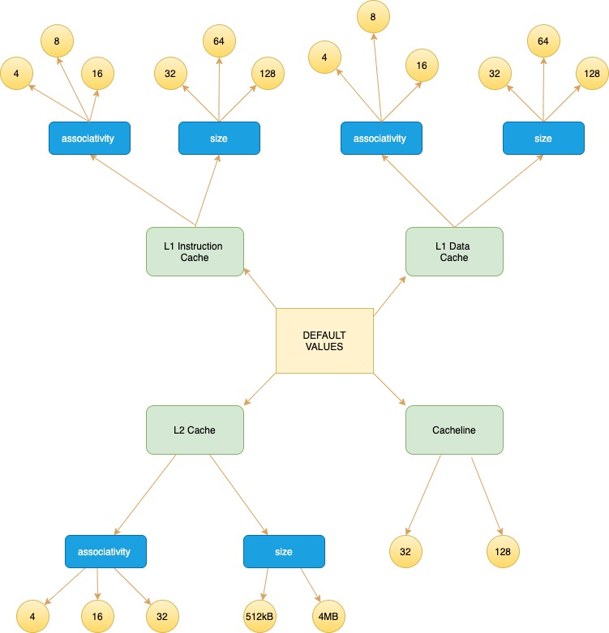
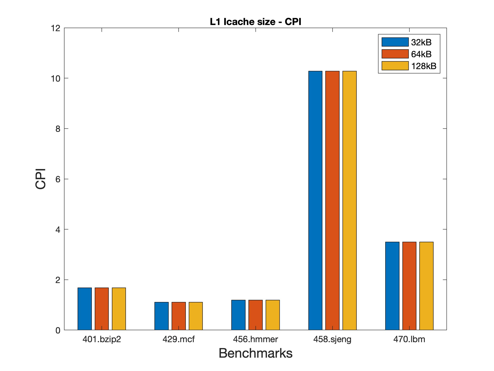 
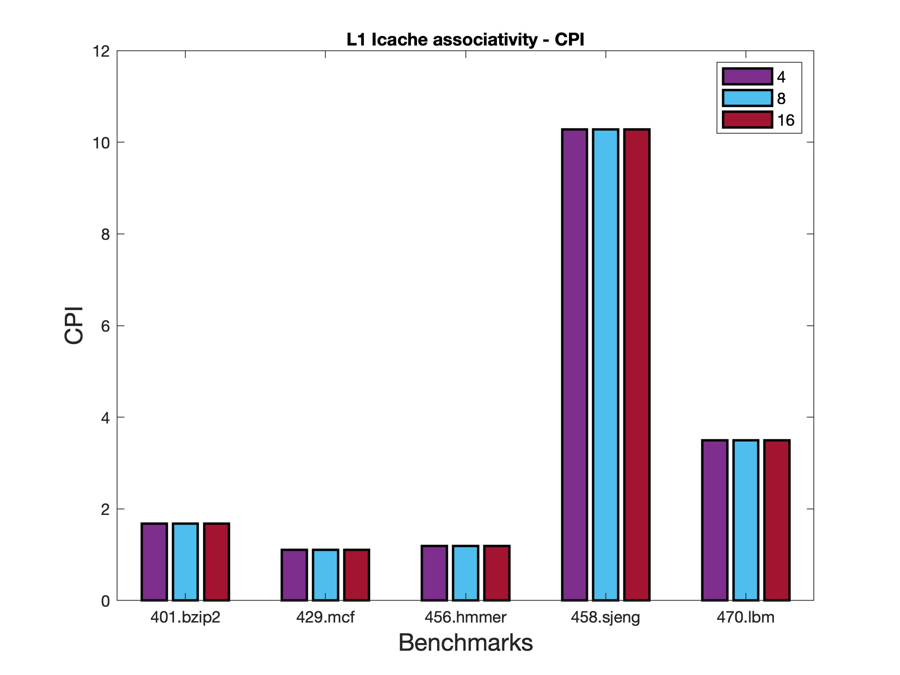 
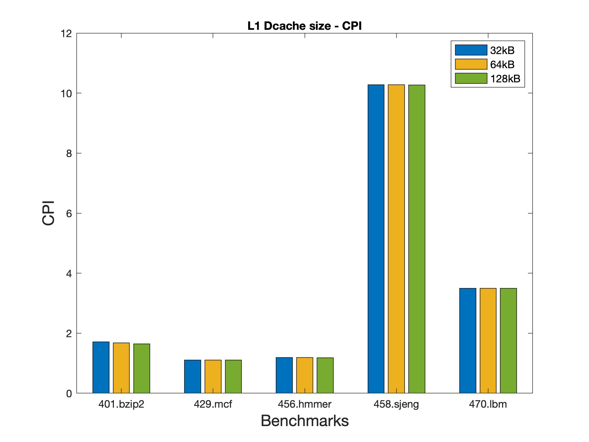 
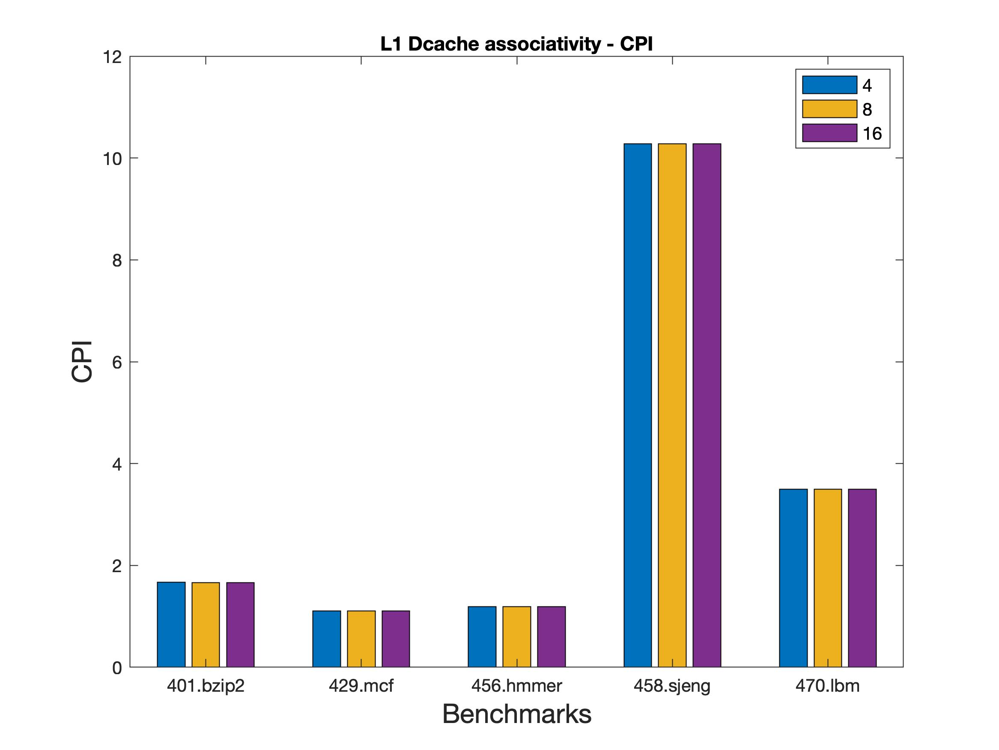 
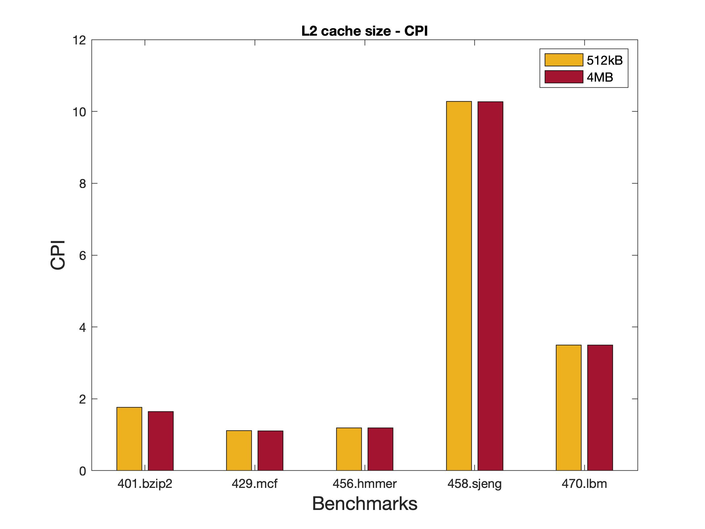 
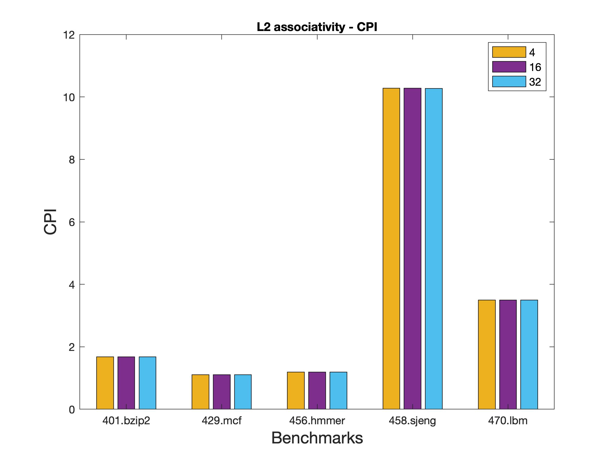 
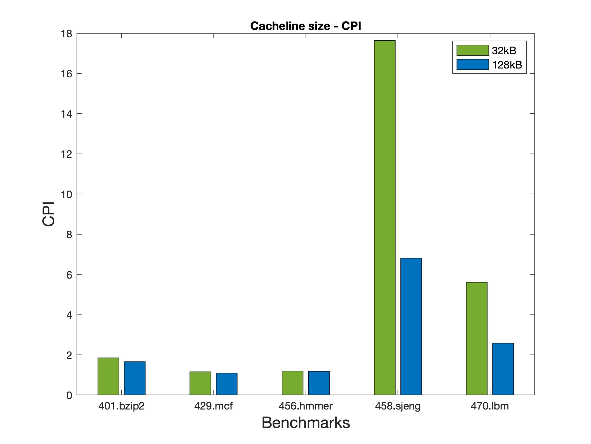 


ΠΗΓΕΣ:

1)http://www.gem5.org/assets/files/ASPLOS2017_gem5_tutorial.pdf
2)https://www.spec.org/cpu2006/
3)http://pages.cs.wisc.edu/~markhill/papers/toc89_cpu_cache_associativity.pdf
4)https://eecs.oregonstate.edu/research/vlsi/teaching/ECE472_FA12/Chapter5_FINAL_ASSOC_VM.pdf  
5)https://www.geeksforgeeks.org/types-of-cache-misses/
